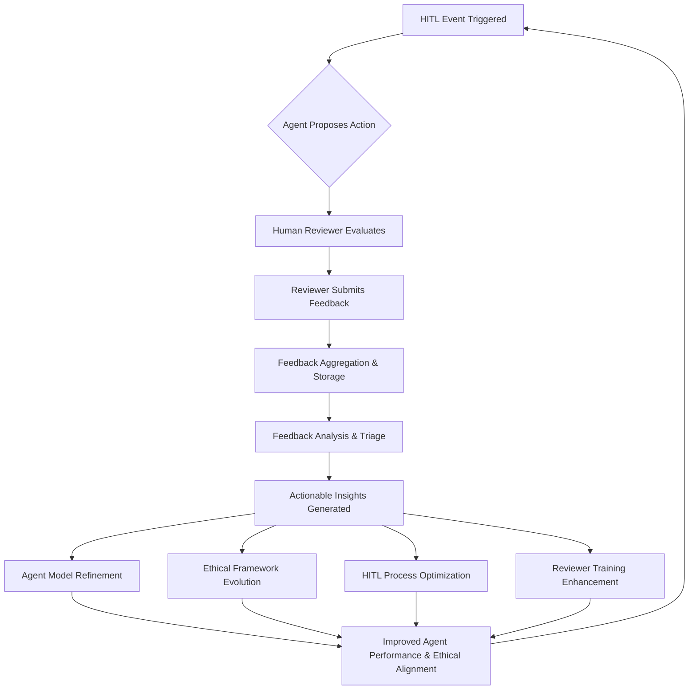

# KFM Agent HITL Feedback Integration Strategy

## 1. Introduction

This document outlines the strategy for systematically processing and integrating feedback from Human-in-the-Loop (HITL) reviews to continuously improve the Kill-Fuck-Marry (KFM) autonomous agent. This includes enhancing the agent\'s decision-making capabilities, refining its ethical alignment, evolving the ethical framework, and optimizing the HITL process itself.

This strategy builds upon the feedback collection methods detailed in `docs/ethical_guidelines/hitl_feedback_mechanisms.md` and the operational workflows in `docs/ethical_guidelines/hitl_workflows.md`.

## 2. High-Level Design Concept: The Continuous Improvement Loop

The core of this strategy is a continuous improvement loop where human expertise directly informs the agent\'s evolution. Feedback serves as a critical input to refine the agent\'s models, its ethical safeguards, and the human oversight process.

**Conceptual Flow:**



**Key Principles Guiding Integration:**

*   **Data-Driven:** Changes and refinements are based on aggregated data and identified trends from feedback, rather than isolated incidents alone.
*   **Iterative:** The process involves regular cycles of feedback collection, analysis, and integration, allowing for gradual and continuous improvement.
*   **Transparent:** Changes made to the agent, ethical framework, or HITL process as a result of feedback will be documented, along with their rationale.
*   **Collaborative:** Effective integration requires collaboration between human reviewers, KFM agent developers, the AI Ethics and Governance Council, and operations teams.

## 3. Feedback Processing Workflow

A structured workflow is essential to transform raw feedback into actionable improvements:

1.  **Collection & Aggregation:**
    *   As defined in `docs/ethical_guidelines/hitl_feedback_mechanisms.md` (Section 4 & 5). All feedback is centralized.

2.  **Triage & Categorization:**
    *   **Responsibility:** Operations Team or a dedicated Feedback Analysis Team, with oversight from the AI Ethics Council.
    *   **Process:** Initial review of incoming feedback to categorize it (e.g., agent performance issue, ethical concern, HITL process suggestion, tool usability, documentation gap).
    *   **Prioritization:** Flag urgent issues (e.g., critical safety concerns, major ethical breaches) for immediate attention.

3.  **In-Depth Analysis:**
    *   **Quantitative Analysis:** Identify trends, patterns, and correlations in structured feedback data (ratings, reason codes, decision outcomes).
    *   **Qualitative Analysis:** Thematic analysis of free-text rationale, survey responses, and discussion forum insights to understand underlying causes and nuances.
    *   **Root Cause Analysis (RCA):** For significant or recurring issues, conduct RCA to pinpoint the fundamental drivers.

4.  **Generation of Actionable Insights & Recommendations:**
    *   **Output:** Translate analysis findings into specific, measurable, achievable, relevant, and time-bound (SMART) recommendations for improvement.
    *   **Examples:**
        *   "Update ECM confidence threshold for 'Kill' on 'critical_service' from 0.9 to 0.95 based on consistent reviewer overrides."
        *   "Develop a new training module on identifying indirect bias, based on feedback from Q3 reviewer survey."
        *   "Investigate agent\'s data processing pipeline for component_X, as 30% of HITL reviews cite missing context for this component."

5.  **Action Assignment & Tracking:**
    *   **Assignment:** Recommendations are assigned to the appropriate teams (e.g., KFM Development, AI Ethics Council, Operations, Training Team).
    *   **Tracking:** A system (e.g., project management tool, issue tracker) will be used to track the implementation status of each recommendation.

## 4. Integration Pathways: Applying Feedback for Improvement

Actionable insights are channeled into specific improvement activities across different facets of the KFM agent system:

### 4.1. Improving Agent Decision-Making (Technical Integration)

*   **Direct Knowledge Base Corrections:**
    *   **Mechanism:** Identified factual errors or critical missing data points from reviewer feedback can be directly corrected or added to the agent\'s knowledge base (e.g., updating vector stores like ChromaDB, or structured data sources).
    *   **Process:** Implemented by the KFM Development or Data Science team, with validation.
*   **Model Re-training & Fine-tuning:**
    *   **Mechanism:** Curated datasets of HITL events (agent proposal, human decision, rationale, especially for overrides and vetoes) are used to fine-tune the KFM planner LLM or other predictive models. This helps the agent learn from human judgment patterns.
    *   **Frequency:** Periodic (e.g., quarterly, semi-annually) or triggered by significant performance degradation or accumulation of sufficient new training data.
    *   **Considerations:** Requires careful data preparation, bias assessment in the feedback data itself, and rigorous testing of the newly fine-tuned model.
*   **Algorithm & Heuristic Adjustments:**
    *   **Mechanism:** Feedback might reveal flaws or areas for improvement in the agent\'s core algorithms, heuristics, or reasoning logic (beyond just the LLM).
    *   **Process:** Investigated and addressed by the KFM Development Team through code changes and testing.

#### 4.1.1. Technical Details for Creating Curated Datasets for LLM Fine-tuning

This subsection details the process of transforming HITL feedback into high-quality datasets suitable for fine-tuning the KFM planner LLM or other predictive models within the agent.

*   **A. Data Sources & Elements to Capture:**
    The foundation of a good fine-tuning dataset is comprehensive data from each HITL review event. Key elements include:
    *   **HITL Event ID:** Unique identifier for linking all related data.
    *   **Agent\'s Original Proposal:**
        *   The proposed action (Kill, Fuck, Marry, No Action).
        *   The target component(s)/process(es).
        *   The full, verbatim reasoning text provided by the agent.
        *   The agent\'s confidence score for its proposal.
        *   Snapshot of key input data, metrics, and context available to the agent at the time of its decision (this forms the "prompt context" for the LLM).
    *   **Human Reviewer\'s Feedback & Decision:**
        *   The final decision made by the human reviewer (Approve, Override, Reject/Veto, Defer).
        *   If an override occurred: The specific alternative action and target chosen by the human.
        *   Structured Reason Code(s) selected by the reviewer to categorize their deviation from the agent's proposal (e.g., `DATA_INTERPRETATION_ERROR`, `MISSING_CONTEXT_AGENT`).
        *   The detailed free-text rationale provided by the reviewer, explaining their decision (this is often the most valuable part for capturing nuanced human judgment).
        *   (Optional) The reviewer\'s stated confidence in their own decision.
        *   (Optional) Any specific missing information or incorrect data points the reviewer identified in the agent's original assessment.
    *   **Timestamps:** For the HITL event creation and the human review completion.

*   **B. Data Format for Fine-tuning:**
    The data needs to be structured into a format suitable for the chosen fine-tuning method, typically prompt-completion pairs.
    *   **Prompt Construction:** The "prompt" should ideally replicate the information state the agent had, leading to its proposal, augmented by the human feedback.
        *   *Example Prompt Core:*
            ```
            System: You are the KFM Planner. Given the following system state, contextual information, and potentially a previous flawed proposal, generate an optimal KFM plan (action, component, reasoning, confidence).
            ---
            System State & Context:
            Component: component_A (type: critical_service)
            Metrics: latency_ms=650 (threshold: 500ms), cpu_utilization=95% (threshold: 90%), active_connections=1200
            Recent Events: Latency spike detected 15 minutes ago. No recent deployments for component_A.
            Current Agent Action: No Action
            ---
            Previous Agent Proposal (if human overrode/rejected):
            Action: Kill
            Target: component_A
            Confidence: 0.80
            Reasoning: Severe performance degradation (latency and CPU breaches) indicates an unrecoverable state requiring immediate restart to prevent further impact.
            ---
            Human Reviewer Feedback (Reason for Override):
            Reason Code: RISK_ASSESSMENT_INCORRECT
            Rationale: While performance is degraded, component_A is a critical_service with widespread dependencies. An immediate Kill could trigger a cascading failure. A less disruptive initial action is required.
            ---
            Based on all the above, provide the refined KFM plan:
            ```
    *   **Completion Construction (The "Correct" Output):** The "completion" is the desired output the LLM should learn to generate, based on the human reviewer's validated decision and rationale.
        *   *Example Completion (corresponding to the prompt above, based on a human override):*
            ```json
            {
              "action": "Fuck",
              "component": "component_A",
              "reasoning": "Component_A, a critical service, is experiencing severe performance degradation (latency 650ms, CPU 95%). While a Kill action was initially considered, the high risk of cascading failures due to its criticality makes this imprudent as a first step. The refined plan is to Fuck component_A by first attempting to stabilize it through resource scaling (e.g., increase CPU/memory allocation). This intervention aims to alleviate the immediate performance bottleneck. The component's status will be closely monitored for the next 10 minutes. If performance does not improve significantly, a Kill action will be re-evaluated as a necessary escalation.",
              "confidence": 0.95
            }
            ```
    *   **Alternative Formats:**
        *   **Conversational:** If fine-tuning a chat-optimized model, the interaction could be framed as a dialogue.
        *   **Instruction-Following:** Using specific instructions like, "Refine the KFM plan based on the provided context and human feedback."

*   **C. Curation Process & Quality Control:**
    Transforming raw feedback into a high-quality dataset requires careful curation:
    *   **Filtering & Prioritization:**
        *   Prioritize HITL events where human reviewers provided clear, detailed, and actionable rationales, especially for overrides and rejections. These offer the richest learning signals.
        *   Initially, "Approve" decisions might be down-weighted unless they represent scenarios where the agent correctly handled a particularly complex or ambiguous case (positive reinforcement).
        *   Exclude reviews with ambiguous, incomplete, or very low-confidence human feedback if the rationale is unclear.
    *   **Data Transformation & Normalization:**
        *   Convert structured reason codes and other categorical feedback into natural language snippets that can be incorporated into the prompt or help shape the target completion.
        *   Standardize terminology and phrasing where appropriate, without losing critical nuances from the human rationale.
        *   Ensure any sensitive or PII (if accidentally captured, though unlikely in KFM context) is anonymized.
    *   **Data Annotation (Optional, but Enhances Quality):**
        *   For complex rationales, a dedicated annotation step by SMEs could break down the human reasoning into more granular "correction types" or "insight categories." This can help in stratified sampling or weighting during fine-tuning.
        *   Identify and label instances of specific cognitive tasks (e.g., "long-term strategic thinking," "causal reasoning beyond immediate data") demonstrated by the human reviewer that the agent should learn.
    *   **Addressing Potential Bias in Feedback:**
        *   Reviewer feedback is not infallible and can contain its own biases. Implement processes to detect and mitigate this:
            *   Analyze inter-reviewer agreement on similar scenarios. Significant, consistent disagreement may indicate a need for clearer guidelines or that the scenario is too ambiguous for simple fine-tuning.
            *   Involve the AI Ethics and Governance Council in reviewing curation guidelines and sample datasets to identify potential systemic biases being encoded.
    *   **Data Augmentation (Use Judiciously):**
        *   Techniques like paraphrasing human rationales or generating minor variations of scenarios can expand the dataset. However, this must be done with extreme care by SMEs to avoid introducing noise, factual inaccuracies, or diluting the original human intent.

*   **D. Dataset Structuring & Management:**
    *   **Standard Splits:** Divide the curated data into training, validation, and test sets to evaluate model performance and prevent overfitting.
    *   **Versioning:** Implement strict version control for datasets as they are updated and expanded over time. Changes to the dataset should be auditable.
    *   **Comprehensive Metadata:** Each dataset version should be accompanied by metadata detailing its creation date, source HITL event range, number of unique reviewers contributing, curation criteria, any known limitations, etc.

*   **E. Required Tooling & Infrastructure:**
    *   **Feedback Data Lake/Warehouse Access:** Robust, secure, and ideally programmatic (API-based) access to the centralized repository where all HITL feedback is stored.
    *   **Data Processing & ETL Pipelines:** Scripts and tools (e.g., Python with libraries like Pandas, spaCy for NLP tasks) for extracting, cleaning, transforming, and formatting the feedback data into the desired fine-tuning structures.
    *   **Annotation Platforms (if manual annotation is part of the workflow):** Tools such as Label Studio, Doccano, Prodigy, or custom-built interfaces designed for annotating complex textual data and decision rationales.
    *   **Curated Dataset Storage:** Secure and scalable storage for the processed fine-tuning datasets (e.g., cloud storage buckets, dedicated databases).

*   **F. Validation and Verification of Curated Datasets:**
    Before a dataset is used for fine-tuning, it must undergo rigorous validation:
    *   **Subject Matter Expert (SME) Review:** A panel of senior reviewers, KFM system architects, and AI ethicists should review representative samples of the curated dataset to:
        *   Verify the accuracy of the transformation from raw feedback into the structured fine-tuning format.
        *   Confirm the clarity, correctness, and appropriateness of the "target completions" derived from human decisions.
        *   Assess whether any unintended biases have been introduced or amplified during curation.
    *   **Inter-Annotator Agreement (IAA):** If a manual annotation step is involved with multiple annotators, calculate IAA scores (e.g., Cohen's Kappa, Krippendorff's Alpha) to ensure consistency and reliability of the annotations. Low IAA would trigger retraining of annotators or refinement of annotation guidelines.

By adhering to these technical details, the KFM project can create high-impact curated datasets that effectively channel human expertise back into the agent, fostering a truly learning system.

### 4.2. Evolving the Ethical Framework (Policy & Rule Integration)

*   **Ethical Configuration Manager (`ECM`) Updates:**
    *   **Mechanism:** Feedback indicating unflagged ethical concerns, inconsistencies in applying ethical rules, or that existing ECM parameters (thresholds, weighted criteria) are suboptimal will inform adjustments.
    *   **Process:** Proposed changes to `ECM` logic or parameters are reviewed and approved by the AI Ethics and Governance Council, then implemented and thoroughly tested by the KFM Development Team.
*   **Policy & Guideline Revisions:**
    *   **Mechanism:** Systemic ethical issues, ambiguities, or gaps identified through feedback will trigger revisions of:
        *   `docs/ethical_guidelines/hitl_workflows.md`
        *   `docs/ethical_guidelines/ethical_principles.md` (or equivalent core ethics document)
        *   Other relevant operational or ethical policy documents.
    *   **Process:** Draft revisions are prepared by/for the AI Ethics Council, reviewed by relevant stakeholders, and then formally adopted and disseminated.
*   **Updating Ethical Ontologies/Taxonomies (if applicable):**
    *   **Mechanism:** If the KFM system uses a formal ontology or taxonomy for ethical concepts, feedback can lead to its expansion, refinement, or restructuring to better capture observed nuances.

### 4.3. Optimizing the HITL Process & Tools

*   **Workflow Adjustments:**
    *   **Mechanism:** Feedback on the necessity of interventions, trigger sensitivity, or clarity of the Review Package content can lead to modifications in the `docs/ethical_guidelines/hitl_workflows.md` (e.g., adjusting trigger conditions, information presented to reviewers).
*   **Review Interface Enhancements:**
    *   **Mechanism:** Direct feedback on the usability, clarity, or missing features of the HITL review dashboard, CLI, or other tools will inform UI/UX improvements.
*   **Documentation & Training Material Updates:**
    *   **Mechanism:** Feedback indicating reviewer confusion, knowledge gaps, or areas where existing documentation is unclear will lead to updates in:
        *   `docs/training/hitl_reviewer_training_program.md`
        *   User guides for review tools.
        *   FAQs and support materials.

## 5. Monitoring and Reporting on Integration Impact

To ensure the feedback integration strategy is effective, its impact will be monitored:

*   **Key Performance Indicators (KPIs):**
    *   **Agent Alignment:** Reduction in the rate of human overrides/vetoes for scenarios previously addressed by feedback integration.
    *   **HITL Efficiency:** Changes in average time taken per review; reviewer feedback on process efficiency.
    *   **Ethical Compliance:** Reduction in instances of unflagged ethical concerns.
    *   **Reviewer Satisfaction:** Measured through periodic surveys on the agent\'s improvement and the effectiveness of the HITL process.
    *   **Feedback Implementation Rate:** Percentage of actionable insights implemented within a defined timeframe.
*   **Reporting:** Regular reports (e.g., quarterly) will be provided to stakeholders (KFM Development, AI Ethics Council, Leadership) on feedback trends, integration activities undertaken, and measured impact.

## 6. Roles and Responsibilities for Feedback Integration

*   **Human Reviewers:** Provide detailed and constructive feedback.
*   **Operations Team / Feedback Analysis Team:** Manage the feedback collection, triage, initial analysis, and tracking of actions.
*   **KFM Agent Development Team:** Implement technical changes to the agent, models, knowledge base, and review tools based on prioritized feedback.
*   **Data Science / ML Team:** Conduct model retraining/fine-tuning and sophisticated data analysis.
*   **AI Ethics and Governance Council:** Oversee the entire feedback integration process, approve changes to the ethical framework and policies, ensure ethical considerations are paramount, and review impact reports.
*   **Training Team:** Update and deliver training materials based on identified needs from feedback.

## 7. Review and Update of this Integration Strategy

This feedback integration strategy itself will be reviewed periodically (e.g., annually) by the AI Ethics and Governance Council and key stakeholders to ensure its continued effectiveness, relevance, and alignment with the overall goals of the KFM agent project. 